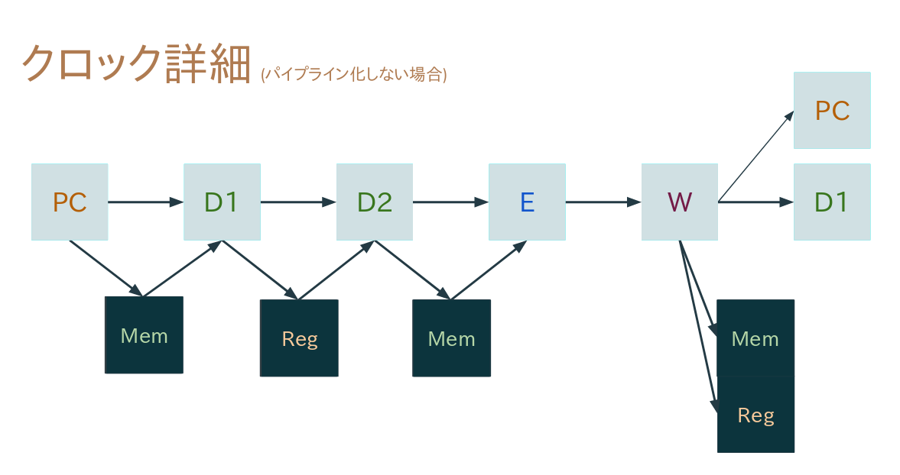

# マイクロプロセッサの設計と実装 レポート

03-170485 上田 草馬

## 設計の概要

5段ステージを持つ、パイプラインCPUを作りました。

設計上は、終了時にsw=1にするとPCの値とsysclk,instructionのカウントが
OLED上に表示されるようになっているはずです (FPGAに焼けなかったので……)

### ステージ

ステージの一覧は次のとおりです。

 * F: Fetch Instruction (instruction\_counter.v, writeback.v)
 * D1: Decode; Fetch Register (predecoder.v)
 * D2: Decode; Fetch Memory (decoder.v)
 * E: Execute (executor.v)
 * W: Writeback (writeback.v)

それぞれのステージはposedgeで実行され、メモリおよびレジスタの読み込みはnegedgeで
実行されています。

FDEMWではなくFPDEW構成を取ったのは、単純にコンピュータアーキテクチャ講義のFDEWに
影響を受けすぎたからです。D1でレジスタフェッチ (をするための準備) をしているのは
LW命令がレジスタとメモリの両方からフェッチする仕様になっていたからです。



#### Fステージ

Fステージは、PCを生成してD1ステージに渡すということをしています。PCの生成場所は、
ジャンプ命令が実行された場合はwriteback.vが、ジャンプ命令が実行されない場合は
instruction\_counter.vが生成します。これにより、ジャンプ先の命令は、
ジャンプ命令実行の次のクロックで、FステージではなくD1ステージを実行することが可能となっています。

```
# 通常
100: ADD r1,r2,r3 : FPDEW
104: ADD r2,r3,r4 :  FPDEW
108: ADD r3,r4,r5 :   FPDEW
10c: ADD r4,r5,r6 :    FPDEW
110: ADD r5,r6,r7 :     FPDEW
```

```
100: J 104   : FPDEW
104: J 108   :     fPDEW  # PCではなくWritebackがアドレス生成します
```

#### D1ステージ

D1ステージは、instructionを分解して、主に読み書きレジスタの決定とオペランドの変換を行っています。

書き込みレジスタの決定は、後述するハザード防止のために行われています。

オペランドの変換が正しい言葉なのかはわかりませんが、だいたい次のようなことをやっています。

```
# ra, rbはオペランドになります。rs,rt,rdの名前がin/outなのか分かりにくいので
# inの名前としてra,rbが使われています。
# rar, rbrは読み込むレジスタのインデックスになります
# rav, rbvは素の値です
# 次のD2ステージには、rav = (rar == 0) ? rav : (read_register(rar));のような形で
# rav, rbvが渡ることになります。
ADD  r4, r2, r3 # -> op=aux_add, rar=r2, rbr=r3, rout=r4
ADDI r4, r2, 4  # -> op=aux_add, rar=r2, rbr=0, rbv=4, rout=r4 即値AUX命令はこれ以降通常AUX命令として扱われることになります

LW   r4, 4(r1)  # -> op=lw, rar=r1, rbr=0, rbv=4, rout=r4 D2ステージでr1+4を実行するのでその準備をするだけです
```

また、未対応命令にはerrno=illegal\_instructionが出力され、この命令が無事にWステージまで行くことができれば
illegal\_instructionエラーでhaltすることになります。

#### D2ステージ

D2ステージは、主にメモリの読み書きアドレス生成と、条件ジャンプ命令のジャンプ可否を判断しています。

書き込みアドレスの決定は、後述するハザード防止のために行われています。

条件ジャンプ命令は、VJ命令 (rav==1のときにジャンプ) に変換されます。NOP/J命令にしなかったのは謎です。
また、このジャンプするかどうかの情報は使われていません。

#### Eステージ

機械語を実行するだけです。HALT命令はここでerrno=haltedとなり、illegal\_instructionと同様にWステージまで行って
初めてhaltすることになります。

#### Wステージ

ただEステージから引き継いだ情報をメモリ、レジスタ、PCなどに渡しているだけです。
errno!=successであれば、以降のクロック生成も止めて無事(？)にhaltすることになります。


### ハザード

パイプライン化に伴うメモリおよびレジスタのハザードを防止するために、
{memory,register}\_arbitrator.vがあります。

今回作ったCPUはinstructionとdataが同居したアドレッシングになっていますが、
実行時に機械語を書き換える場合には、その書き換えられた機械語を実行するまでの間にジャンプ命令を実行して
パイプラインをフラッシュしなければならないという制限を加えることにより、
レジスタはD1ステージ読みWステージ書き、メモリはD2ステージ(data)読みWステージ書きだけを考えることができ、
ハザードの条件を幾分か緩和しています。

なお今回、スーパースカラなどにより実行する機械語の順番が前後することはないため、
ハザードはwrite→readだけを考えればいいことになります。そこで、
D1ステージで書き込みレジスタ、D2ステージで書き込みメモリのロックを取得し、
Wステージでそれらを解放するという処理をしています。

Wステージの出力レジスタ/メモリ値は、フォワーディング(？)処理によりD2/Eステージに直接送られることになります。
レジスタのフォワーディングはregister.vで行われています。

ハザードによるパイプラインストール中は、後続のステージにNOP (ADD r0, r0, r0) 命令が出力されたと同様の
扱いを行うことになっています。(ステージ処理中のPCが0xffff\_ffffになるのでストールかどうかがわかるように
なっています)


# 苦労した実装

* パイプラインストールに地味に苦労した気がします。メモリコリジョンで
  Eステージが実行できないときにはD2ステージもD1ステージも実行できなくなるという
  条件を作るのにどうもやけに苦労しました。
* パイプライン化自体は、パイプライン化を視野に入れた構成にしていた
  (ステージは基本的に前のステージにしか依存しない、前の前のステージに
   依存するときは前のステージが受け流す)
* out\_npc (勘違いしていたのでコード中のnpcはNow PCでありNew PCではありません)
  が0xffff\_ffffかどうかでexecuteしたかどうかが判定できるしたのは前述しましたが、
  instruction\_executed = clk && out\_npc; としたときに、
  out\_npcが0xffff\_ffffからその他の値に変わるときに、
  instruction\_executedが瞬間的に1になるために、実行instruction数が
  実際の値よりも大きくでてしまうということがありました。
* ずっと非同期リセットで組んでいたので、回路の依存度が増えて
  Clock=100ns/cycleでないとTiming Constraintsに違反するということがありました。
* FPGAに焼く際、SynthesisプロセスでCPU実行部分がごっそり最適化されているようです……？
  理由は不明ですが、焼いても全く意味のない計算をするようです；；

# 性能評価

プレゼン発表のときに33%程度の処理時間に高速化が出来たといいましたが、
上記の理由により間違いになります。

なお、同期リセットにしたところ、クロックは4ns/cycleでも動くようです、
がこれはSynthesisでCPU動作部分が全部最適化により消え去った値だと考えられるため、
あまり意味がないと思われます。

## パイプライン化によるクロック数の評価

sample1.ram: 22instruction, 46sysclk -> パイプライン化により52%にsysclk削減 (削減率48%)
sample2.ram: 65instruction, 131sysclk -> 50%
sample3.ram: 2446instruction, 5519sysclk -> 56%
sample4.ram: 105015instruction, 217777sysclk -> 51%
samplef.ram: 103655instruction, 216525sysclk -> 52%


Behavioral Simulation上では、ほとんどの場合で半分に満たない程度のsysclk削減が出来るようです。

パイプラインの構成上初期動作に4sysclkが必要なことが、特にsample1のような短い
プログラムで足を引っ張っています。

メモリのハザードは条件が厳しく、連続した機械語でwrite,readを行わないと
ストールしないため、sampleでのストール理由はメモリに起因するものはありませんでした。

sample3,4では、ジャンプ命令によるパイプラインフラッシュによる3sysclkのペナルティが
明らかになる結果となりました。

## 性能改善に向けて

* LW以外の命令について、D1ステージではなくD2ステージでレジスタロックの取得/チェックができれば、
  レジスタハザードによるペナルティが1sysclk減るため、かなりの高速化が見込まれます。
  (sample1.ramなら20%程度は高速化出来るのではと考えています)
  ただし、この場合レジスタロックの取得/チェックがD1ステージとD2ステージの二つに増えるため、
  設計で注意しないとデッドロックが発生する可能性があります。
  今回は、ロックチェックが1ステージで完結するために、設計が簡単でした。
* ジャンプするかどうかはD2ステージで決定しているので、その情報を使って
  ジャンプ命令がEステージに到達した段階でジャンプ先の機械語をD1ステージに投入することができれば、
  パイプラインフラッシュによるペナルティが3sysclkから1sysclkに低減すると考えられます。
* 同様にD1ステージの時点で分岐予測ができれば、パイプラインフラッシュペナルティは
  最も予測がうまく行くときで0sysclkにすることすら可能であります。
* スーパースカラ化やアウトオブオーダーに思考が追いつけば良かったのですが……
